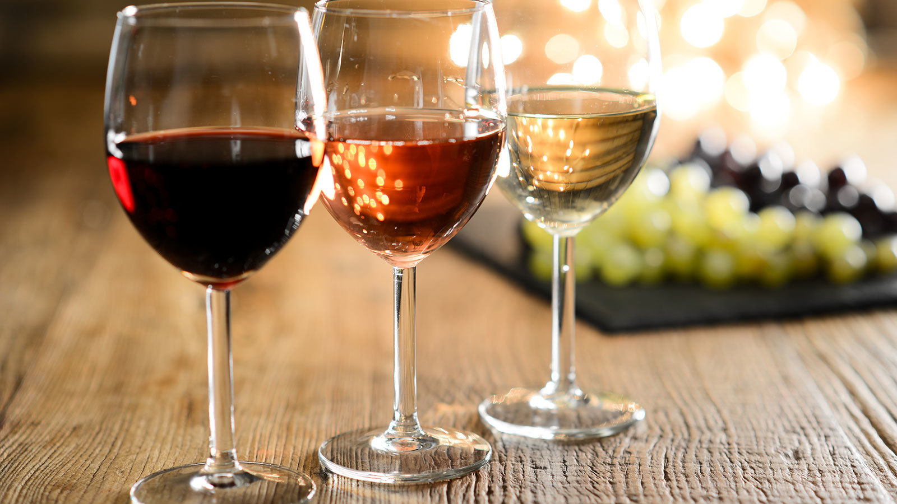

---
title: 'Final Project: Wine Quality' 
author: "Zhuolin Luo"
date: "Due December 17, 2019"
output:
  html_notebook:
    df_print: paged 
--- 

# Set Up

Let's cheers [here's the link](https://en.wikipedia.org/wiki/Wine)!  This page has introduced to us about wine, though I believe most of you have tasted, drunk it and even been a wine lover. However, you might never explore things such as which country produces the best wine, from which kind of grapes make the best wines, what mights be the most essential chemical factors that contributes to the quality of wines and so on. 


```
Wine is such an amazing thing for many people around the world. My exploration about wine can be divided into two main parts: review exploration with country exploration, grape exploration and taster exploration taken into consideration as well as chemical factor explorationand chemical factor exploration. At the very beginning, I have a general view on the distribution of wine country in the data source. And then, standing on the customers' side, I find the country that produces the best wine and the Top 10 Countries by average rating. Standing on the producers' sides,  I find the type of grapes that produces the best wine. Moreover, based on the cases--tasters, what are the wine country origins tried by the top 5 tasters can reflect some important information to some degree, including the most popular wine country origins related to the tasters' preferences and so on.
As for the second past, assuming that we have been hired by a winery, the goal for us is to identify which chemical properties most influence the quality of wines. During the process, we can also find the differences in features between two types of wines!
```

### Clean up environment and load packages
```{r}
# clean up the RStudio environment 
rm(list = ls())

# load all packages here: `mosaic`, `tidyverse`, `lubridate`, and all others used
library(DataComputing)
library(tidyverse)
library(party)
library(mosaic)
library(psych)
library(dplyr)
```

### Data Intake
```{r}
WineReview <- read_csv("winemag-data-130k-v2.csv")
WineQuality <- read.csv("winequalityN.csv")
```

### Always inspect the data tables when you load them
```{r}
glimpse(WineReview)
glimpse(WineQuality)
```

### Country Exploration

#### At the most beginning, to know which countries are present and how are the reviews distributed.
```{r}
wineCtry <-
  WineReview%>% 
  group_by(country) %>% 
  summarise(total = n()) %>% 
  arrange(desc(total)) %>% 
  mutate(totpcnt = round(total/ sum(total), digits=7), accum = cumsum(totpcnt))

wineCtry
``` 
```
To keep the bar graph legible, we limited to just the top 10 countries.
```
```{r}
wineCtry%>%
  head(10)%>%
  ggplot( aes(x= reorder(country,-total), y = total, fill = country))+
  geom_col() + 
  geom_text(aes(label = sprintf("%.1f %%", 100*totpcnt), y = total + 1500)) +
  labs(x="Country", y="Total Reviews", title="Distribution of Wine Reviews by Top 10 Countries")
```
```
Based on our graph, we can notice that so far, the US has the most wine reviews in this dataset, accounting for 42% of all reviews. However, considering the data was scraped from WineEnthusiast, an American-based publication, this is not too surprising. The next most frequent countries in our dataset are France with 17%, Italy with 15%, and Spain with 5%. We also see from the cumulative percentages in our table that the top 10 countries account for about 96% of the data. 
```

#### Find the Top 10 best wine producing countries (by percentage)
```{r}
BestWineNum<-
  WineReview%>%
  select(country, points)%>%
  na.omit()%>%
  filter(points > 95)%>%
  group_by(country)%>%
  summarise(bestNum = n())

TotalWineNum<-
  WineReview%>%
  select(country, points)%>%
  na.omit()%>%
  group_by(country)%>%
  summarise(totalNum = n())

BestWinePer<-
  BestWineNum%>%
  inner_join(TotalWineNum, by="country")%>%
  mutate(bestPer = bestNum/totalNum*100)%>%
  arrange(desc(bestPer))%>%
  head(10)
BestWinePer
```

```{r}
BestWinePer%>%
  ggplot(aes(x=reorder(country,bestPer), y = bestPer))+
  geom_bar(stat='identity',fill = "navy") +
  geom_text(aes(label = sprintf("%.2f%%", bestPer)))+
  labs(x = 'country', y = 'Percentage', title = 'Best Wine Producing Country - By Percentage') +
  coord_flip() 
```
```
Considering the data was scraped from WineEnthusiast, an American-based publication, and the US has the most wine reviews in this dataset, it can be unfair if I judge a best wine producing country only by calculating the number of the best wines(grading above 95) from a country in this data set. To remove the scale effects, I calculate the percentage to solve the problem. And as you can see, Hungary is the best wine producing country, the second one is Germany, then France. The more easily seen graph is shown below.
```

#### Find the Top 10 Countries by Average Rating
```{r}
wineRating<-
  WineReview %>% 
  select(country, points)%>%
  na.omit()%>%
  group_by(country) %>%
  summarise(avePoints=mean(points))%>%
  arrange(desc(avePoints)) 

wineRating%>%
  head(10)%>%
  ggplot(aes(x=reorder(country,-avePoints), y= avePoints)) + 
  geom_bar(stat="identity", fill = "pink") + 
  coord_cartesian(ylim=c(85,92)) + 
  labs(x="Countries", y="Rating", title="Top 10 Countries by Average Rating")
```
```
From the above graph generated, we can see that England has the highest-rated wines on average, and the US doesn’t even crack the top 10! However, being skeptical of these results (because no one goes to England to try wines), we do a quick count of rows of England and see only 74 results, which is not exactly a fair comparison when the US has 54,504 results.
```
```{r}
WineReview %>%
  filter(country %in% c("England","US"))%>%
  group_by(country)%>%
  summarize(count = n())  
```

### Grape exploration

#### Find the type of grapes that produces the best wine
```{r}
top_10grape <- 
  WineReview %>%
  group_by(variety) %>%
  summarise(count = n(), 
            ave_grape = mean(points))%>%
  filter(count >= 30)%>%
  arrange(desc(ave_grape))%>%
  head(10)

top_10grape
```
```{r}
WineReview%>%
  filter(variety %in% c(top_10grape$variety,10))%>%
  ggplot(aes(x=variety, y = points))+
  theme(axis.text.x = element_text(angle = 90, vjust = 0.5, hjust=1)) +
  geom_boxplot()+
  stat_summary(fun.y = mean, geom = "point",color="blue")
```
```
I have filtered out the data related to those types of grapes that are shown less than 30 times in the WineReview. They should be ignored when relating the average performance of the wine to the type of grape from which it was made. 
And the points distribution of the Top 10 grapes can be seen in the boxplot. We see that the ratings follow a mostly normal distribution. From the boxplots, we can compare the presence of outliers – for example, we see that Sangiovese Grosso has the highest number of outliers, then the Nebbiolo. We can also compare the IQR of values. For example, we see that the Tinto Fino have points that cover the interquantile range of ratings from approximately 84 to 94, but some types of grapes, such as Sangiovese Grosso has the largest outliers and the smallest IQR.
When choosing wine, as a consumer, we can find the wine made from the grape type of Sangiovese Grosso to have a surprising good or bad flavor, or find the wine made from Tannat-Cabernet to gain the biggest probability to taste a good wine. 
```

### Taster exploration

#### Group by taster and sort by total reviews. Analyze reviews distribution
```{r}
wineTstr <- 
  WineReview %>% 
  group_by(taster_name) %>% 
  summarise(total=n()) %>% 
  arrange(desc(total)) %>% 
  mutate(totpcnt = round(total/ sum(total), 7), accum = cumsum(totpcnt))
wineTstr
```
```{r}
wineTstr%>%
  head(10)%>%
  ggplot(aes(x= reorder(taster_name, total), y=total)) + 
  geom_col() +
  theme(axis.text.x = element_text(angle = 90, vjust = 0.5, hjust=1)) +
  geom_text(aes(label = sprintf("%.2f%%", 100*totpcnt), y = total+2000)) +
  labs(x="Wine Taster Name", y="Total Wine Reviews", title="Total Reviews by Wine Taster")
```
```
We find that 21% of our records come from anonymous tasters which might seem a bit strange. But moreover, a single taster accounts for 19.63% of the reviews which raises a lot of concerns for his health and also for the bias this might introduce on the results of the analysis.

Out of curiosity, we decide to look at the different wine country origins tried by the top 5 tasters.
```
#### Different wine country origins tried by the top 5 tasters
```{r}
TopTstrCtry <- 
  WineReview %>% 
  filter(taster_name %in% c("Roger Voss","Michael Schachner","Kerin O’Keefe","Virginie Boone","Paul Gregutt") & taster_name != "" & country != "")%>%
  group_by(taster_name, country) %>%
  summarise(total = n())
TopTstrCtry
```
```{r}
TopTstrCtry %>% 
  ggplot( aes(x=factor(taster_name, levels = wineTstr$taster_name[order(-wineTstr$total)]), 
              y=factor(country, levels= wineCtry$country[order(wineCtry$total)]), 
              size = total, color = country)) +
  geom_point() +
  theme(axis.text.x = element_text(angle = 90, vjust = 0.5, hjust=1)) +
  labs(x="Taster", y="Country of Wine Reviewed",title="Countries Reviewed by Top 5 Tasters")
```
```
We see that most of them clearly focus on a particular country. Our prolific reviewer, Roger Voss, appears to review mostly French wines and two reviewers, Kerin O’Keefe and Virginie Boone, even focus on wines from a single country.
```

### Explore the Chemical factors

#### Wine Quality Distribution
The most important parameter is wine quality. Let's check the distribution of the wine quality first.
```{r}
WineQuality%>%
  ggplot(aes(x=quality))+
  geom_histogram()
```

```
From the histogram generated above, quality of the wines is approximately normally distributed. Most of the wines are rated 5-7, while very few are rated "very poor" (rating < 4) or "very good" (rating > 8). Looking at the dataset we can say that wines rated 6 and larger can be considered as "high", and those rated 5 and smaller can be considered as "low". I create a new variable named qualityFactor to mark the quality level "high" or "low".
```
#### Mark the quality level
```{r}
WineQuality<-
  WineQuality%>%
  mutate(qualityFactor = ifelse(quality<=5, "low", "high"))
```

#### Find the most important factor that contributes to the Wine Quality & Difference between red and white wines
```{r}
boxplot_viz <- function(feature){
  
WineQuality %>%
    ggplot(aes_string(x = as.factor('qualityFactor'), y = feature, color = 'qualityFactor')) +
    geom_boxplot(outlier.color = "black") + 
    labs(title = paste0("Boxplot of feature: ", feature)) + 
    facet_grid(~type)+
    ylab(feature) + 
    xlab("QualityLevel") +
    theme(legend.position = "none", axis.title.x = element_blank()) + 
    theme_minimal()
}

for (i in names(WineQuality %>% select(-'qualityFactor',-'type',-'quality'))){
  print(boxplot_viz(i))
}
```
```
Each of the eleven boxplots generated above shows the general distribution of one specific chemical feature of wines in both high and low quality. There is no doubt that: The more the difference of the graph between two quality levels, the more important the chemical feature is. 
As we can see, the most significant differences between two quality levels appear in the Boxplot of feature: volatile.acidity, residual.sugar, sulphates and alcohol. Thus, these four chemical features can be considered as the four most important factors that contribute to the wine quality. While they influence the wine quality in different direction: higher level of volatile acidity and residual.sugar mean lower quality, however, higher level of sulphates and alchohol mean higher quality.
Moreover, we can also draw a conslusion that there are differences between two types of wines: white and red. For each chemical feature, the level are not the same between two types of wines. For example, We can see that the fixed.acidity, volatile.acidity, pH and sulphates are higher in red wine, but the alcohol performs same. 
```

#### From the four variables we found before, find the most effective model that divides the wines into two quality level
```{r}
CompleteCases<-
  WineQuality%>%
  select(quality, volatile.acidity , residual.sugar , sulphates ,alcohol)%>%
  na.omit()

mod1<-
  party::ctree(
    quality ~  residual.sugar + sulphates,
    data = CompleteCases
  )
plot(mod1, type = "simple")
```
```{r}
CompleteCases%>%
  mutate(probability = as.numeric(predict(mod1)),
         likelihood = 
           ifelse(quality,
                  probability,
                  1-probability))%>%
  summarise(log_likelihood = sum(log(likelihood)))
```
```
A useful chemical feature splits the wines into groups with high quality and low quality. For instance, from the above decision tree, node 9 marks a group with the highest quality, larger than other groups. 
One way to measure the effectiveness of the model is with "log likelihood". A high log likelihood indicates a more successfully predictive model. And above is what I find, the model with the highest log likelihhod is the quality being predicted by residual.sugar and sulphates.
```
